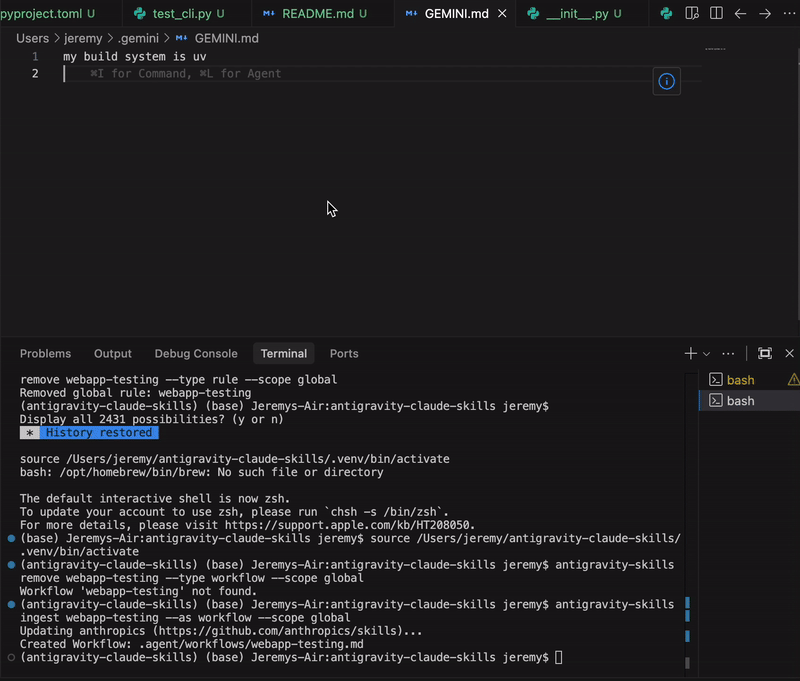

# Antigravity Skills Manager

**Motivation**: A skill management system for the Gemini 3 framework that is interchangeable with the Claude skills frameworks and samples. It allows you to seamlessly ingest and use skills from the broader ecosystem as native Antigravity Workflows or Rules.

**Resources**:
- [Antigravity Documentation](https://antigravity.google/docs/rules-workflows)
- [Anthropics Skills Repo](https://github.com/anthropics/skills)
- [Gemini 3 Framework](https://gemini.google.com) 



This project provides a system to bootstrap **Antigravity Workflows** and **Rules** from external skill repositories.

## Installation

**Prerequisites**:
- Python 3.8+
- [uv](https://github.com/astral-sh/uv) (recommended) or pip

**Install from source (Development)**:
```bash
git clone https://github.com/jwortz/antigravity-claude-skills.git
cd antigravity-claude-skills
uv pip install -e .
```

**Install globally (CLl Tool)**:
To make the `antigravity-skills` command available everywhere in your terminal:
```bash
# from within the directory
uv tool install .

# or directly from git
uv tool install git+https://github.com/jwortz/antigravity-claude-skills.git
```

## Usage

Once installed, you can use the `antigravity-skills` command from anywhere.

### Managing Sources

**Add a Skill Source** (e.g., Anthropics Skills Repo):
```bash
antigravity-skills add-source https://github.com/anthropics/skills
```

**List Sources**:
```bash
antigravity-skills list-sources
```

### Ingesting Skills

**Ingest a skill as an Antigravity Workflow:**
```bash
antigravity-skills ingest webapp-testing --as workflow
```

**Ingest a skill as a Workspace Rule:**
```bash
antigravity-skills ingest webapp-testing --as rule --scope workspace
```
*   **With Activation**:
    ```bash
    antigravity-skills ingest webapp-testing --as rule --scope workspace --activation glob --glob "**/*.test.js"
    ```

**Ingest a skill as a Global Rule:**
```bash
antigravity-skills ingest webapp-testing --as rule --scope global
```

### Managing Installed Skills

**List Installed Workflows and Rules:**
```bash
antigravity-skills list
```

**Remove an Artifact:**
```bash
# Remove a workflow
antigravity-skills remove webapp-testing --type workflow

# Remove a workspace rule
antigravity-skills remove webapp-testing --type rule --scope workspace

# Remove a global rule from ~/.gemini/GEMINI.md
antigravity-skills remove webapp-testing --type rule --scope global
```
*This creates `~/.antigravity/rules/webapp-testing.md`.*

## Configuration

### Managing Sources
You can add your own skill repositories (must follow the `SKILL.md` structure):
```bash
python scripts/skill_manager.py add-source <git_url> [name]
```

### Repo Structure for Skills
The manager expects the source repo to have:
- `skills/<skill_name>/SKILL.md` OR
- `<skill_name>/SKILL.md`

`SKILL.md` should contain YAML frontmatter:
```markdown
---
name: my-skill
description: logic for my skill
---
# Content...
```

## Automating Bootstrapping

To automatically ingest a set of core skills for a new project, you can run a script like this:

```bash
# Ingest core workflows
python scripts/skill_manager.py ingest webapp-testing --as workflow
python scripts/skill_manager.py ingest another-skill --as workflow

# Setup global rules
python scripts/skill_manager.py ingest mcp-builder --as rule --scope global
```

This ensures your environment is always populated with the latest versions of your shared skills.
